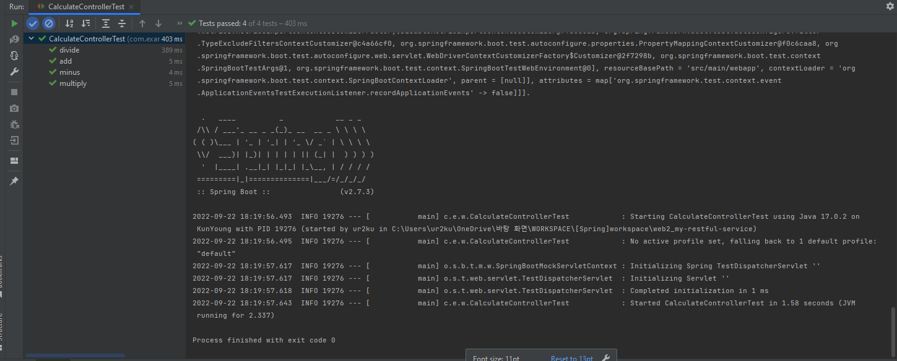
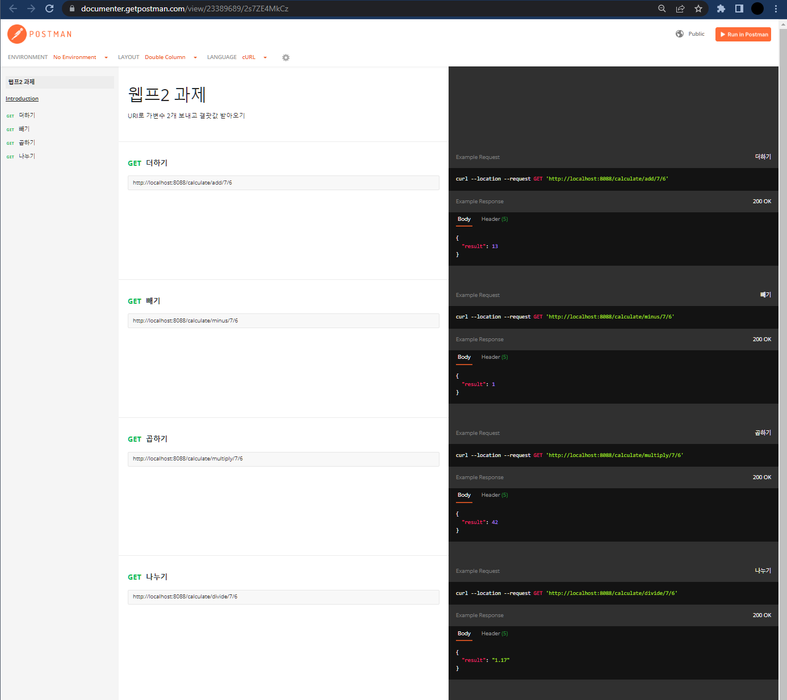

## uri로 가변수 보내고 결과값 받기


- Controller
```java
import org.springframework.http.ResponseEntity;
import org.springframework.ui.Model;
import org.springframework.web.bind.annotation.GetMapping;
import org.springframework.web.bind.annotation.PathVariable;
import org.springframework.web.bind.annotation.RequestMapping;
import org.springframework.web.bind.annotation.RestController;

@RequestMapping("/calculate/")
@RestController
public class CalculateController {

    @GetMapping("/add/{a}/{b}")
    public Object add(@PathVariable("a") int a, @PathVariable("b") int b, Model model) {
        return ResponseEntity.ok(model.addAttribute("result", a+b));
    }
    @GetMapping("/minus/{a}/{b}")
    public Object minus(@PathVariable("a") int a, @PathVariable("b") int b, Model model) {
        return ResponseEntity.ok(model.addAttribute("result", a-b));
    }
    @GetMapping("/multiply/{a}/{b}")
    public Object multiply(@PathVariable("a") int a, @PathVariable("b") int b, Model model) {
        return ResponseEntity.ok(model.addAttribute("result", a*b));
    }
    @GetMapping("/divide/{a}/{b}")
    public Object divide(@PathVariable("a") float a, @PathVariable("b") float b, Model model) {
        return ResponseEntity.ok(model.addAttribute("result", Math.round(a/b)));
    }
}
```

<br/>

- Test 코드
```java

import org.junit.Test;
import org.junit.runner.RunWith;
import org.springframework.beans.factory.annotation.Autowired;
import org.springframework.boot.test.autoconfigure.web.servlet.WebMvcTest;
import org.springframework.test.context.junit4.SpringRunner;
import org.springframework.test.web.servlet.MockMvc;

import static org.hamcrest.Matchers.is;
import static org.springframework.test.web.servlet.request.MockMvcRequestBuilders.get;
import static org.springframework.test.web.servlet.result.MockMvcResultMatchers.jsonPath;
import static org.springframework.test.web.servlet.result.MockMvcResultMatchers.status;

@RunWith(SpringRunner.class)
@WebMvcTest(controllers = CalculateController.class)
public class CalculateControllerTest {

    @Autowired
    private MockMvc mvc;

    @Test
    public void add() throws Exception {
        String a = "7";
        String b = "6";

        int result = Integer.parseInt(a) + Integer.parseInt(b);

        mvc.perform(get("/calculate/add/"+a+"/"+b))
                .andExpect(status().isOk())
                .andExpect(jsonPath("$.result", is(13)));
    }
    @Test
    public void minus() throws Exception {
        String a = "7";
        String b = "6";

        int result = Integer.parseInt(a) - Integer.parseInt(b);

        mvc.perform(get("/calculate/minus/"+a+"/"+b))
                .andExpect(status().isOk())
                .andExpect(jsonPath("$.result", is(result)));
    }
    @Test
    public void multiply() throws Exception {
        String a = "7";
        String b = "6";

        int result = Integer.parseInt(a) * Integer.parseInt(b);

        mvc.perform(get("/calculate/multiply/"+a+"/"+b))
                .andExpect(status().isOk())
                .andExpect(jsonPath("$.result", is(result)));
    }
    @Test
    public void divide() throws Exception {
        String a = "7";
        String b = "6";

        float result = Float.parseFloat(a) - Float.parseFloat(b);

        mvc.perform(get("/calculate/divide/"+a+"/"+b))
                .andExpect(status().isOk())
                .andExpect(jsonPath("$.result", is(Math.round(result))));
    }
}

```

<br/> 

- Test 결과




<br/> 

- 포스트맨 API 테스트 도구 테스트 결과

> https://documenter.getpostman.com/view/23389689/2s7ZE4MkCz


